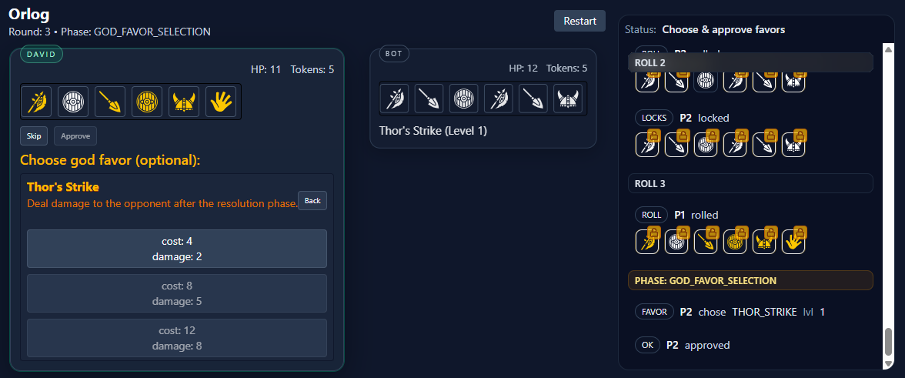

# The Hand of Fate: Training Deep RL Agents for Orlog

**Project for the Deep Learning course 00460217 (Technion) Winter 2025-2026**

<div align="center">
  <br>
  <a href="https://orlog-delta.vercel.app/bot">
    
  </a>
  <br><br>
  <h3><a href="https://orlog-delta.vercel.app/bot"> Play Orlog Online Against Our Agents</a></h3>
  <hr>
</div>

- [Background](#background)
- [Prerequisites](#prerequisites)
- [Files in the repository](#files-in-the-repository)
- [Training](#training)
- [Results](#results)
- [About](#about)

## Background

Orlog is a tactical dice game featuring a three-phase cyclical decision tree: **Roll Phase**, **God Favor Selection**, and **Resolution Phase**. The goal of this project is to develop and evaluate autonomous agents capable of mastering the game's stochastic mechanics and complex resource management.

We implemented and compared two primary architectures:

- **Double Deep Q-Networks (DDQN)**
- **Proximal Policy Optimization (PPO)**

## Prerequisites

Full list of requirements are in the `requirements.txt` file. Required python version is 3.10+. Hardware: CUDA-compatible GPU recommended for training.
To install the requirements, clone the repository and run:

```bash
git clone https://github.com/stargazingdave/self_orlog
cd self_orlog
pip install -r requirements.txt
```

## Files in the repository

| File / Folder | Purpose                                                                     |
| :------------ | :-------------------------------------------------------------------------- |
| `game/`       | Core Orlog game engine and logic.                                           |
| `rl/env/`     | Gymnasium environment, observation encoding, and configuration files.       |
| `rl/ddqn/`    | Custom DDQN implementation and training scripts.                            |
| `rl/pg/ppo/`  | PPO training infrastructure using MaskablePPO.                              |
| `rl/eval/`    | Evaluation suite for win rates, mean returns, and head-to-head tournaments. |
| `outputs/`    | Saved models, training logs, and performance graphs.                        |

## Training

Our pipeline utilizes **Curriculum Learning** to ensure stable adaptation. In order to train the model, use the scripts corresponding to the agent architecture:

```bash
# DDQN Hyperparameter tuning
python -m rl.ddqn.tune.run

# PPO Hyperparameter tuning (Learning Rate & Rollout Buffer)
python -m rl.pg.ppo.tune.lr
python -m rl.pg.ppo.tune.rollout

# DDQN Full 5M step training
python -m rl.ddqn.train.full_5M

# PPO Full 5M step training
python -m rl.pg.ppo.train.full_5M
```

## Results

Results demonstrate that while DDQN dominated the 1M-step Head-to-Head tournament and secured higher benchmark returns in later stages (**0.9776** vs. **0.7141**), PPO_5M achieved ultimate head-to-head dominance. This shift, paired with PPO's lower avg. steps in the tournament, suggests that strategic efficiency and game-ending speed are more decisive in Orlog than the high-margin resource hoarding favored by DDQN.

## Outputs

Model checkpoints and comparative metrics outputs from all runs are available in the [`with-outputs` branch](https://github.com/stargazingdave/self_orlog/tree/with-outputs), under the `outputs/` directory.

## About

Project for the Deep Learning course 00460217 (Technion) Winter 2025-2026
